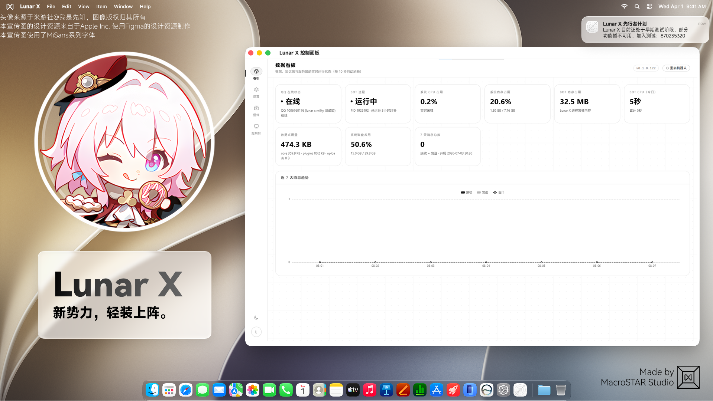

<div align="center">
  
<h1>Lunar X｜新势力，轻装上阵。</h1>
<p align="center">新一代QQ机器人框架，轻便、扩展性强，随心所欲。</p>

     


</div>

---

>[!Caution] 
>为 Lunar X 预备好。
>
>你现在正在查看的是开发预览版本！正式版将于不久之后推出。

## 加入 [Lunar X 先行者计划](https://qm.qq.com/cgi-bin/qm/qr?k=uxFoXR5MU32DgFlNcr66Hdhi2hXyb-qw&jump_from=webapi&authKey=Ov+142qleY2t+gQWr8xo6krv3NXTDg9mY8lNEWHMxgZYHPSfWQFJmo98hZ5N8aS2)

## 概览

Lunar X 是一个全新的 QQ 机器人框架，以「轻便、高效、超强拓展性」为设计理念。框架采用事件驱动的异步架构（asyncio），将协议层、连接层、插件层完全解耦，开发插件只需关注业务逻辑本身，无需接触底层协议细节。

### 核心特性

- **双协议支持**：默认使用 Milky 协议（HTTP API + WebSocket 事件通道），同时完整保留 OneBot v11 适配（WebSocket），通过 `config.json` 中 `protocol` 字段一键切换
- **轻量插件体系**：
  - 支持单文件插件与目录插件（含 `setup.py` 入口）
  - 命令触发与永久触发（`Any`）两种模式，支持优先级排序
  - 热重载：文件监控自动检测插件变更并重载，`{触发符}重载插件` 手动刷新
  - 启停即改名：插件文件名添加 `d_` 前缀即可禁用，无需修改任何配置
- **统一事件模型**：消息（私聊/群聊）、通知（撤回/禁言/戳一戳/群变动等）、请求（好友/入群/邀请）、元事件与框架生命周期事件全覆盖
- **完整的消息段体系**：文本、@、图片、表情、语音、视频、文件、引用、合并转发等消息段，另附 CQ Code 解析等工具
- **动态 API 调用**：`bot.diy.任意接口名(...)` 即可直接调用协议端任意接口，无需逐个封装
- **WebUI 管理面板**（`webui.py`）：仪表盘、实时日志控制台、插件商店（GitHub 仓库源）、配置在线编辑、Bot 进程一键重启
- **内置实用插件**：AI 对话（OpenAI 兼容接口）、群聊语录（SQLite 存储）、定时任务（重启自动恢复）、群管理（禁言/踢人/全体禁言/公告）
- **完善权限体系**：超级用户 / 管理员 / 普通用户三级权限，管理员列表可在线维护

### 项目结构

```
Lunar_X/
├── main.py            # 入口，加载配置并启动 LunarBot
├── webui.py           # Flask WebUI 管理面板
├── core/              # 框架核心
│   ├── bot.py         # 主控制器（事件分发、原生命令、发送入口）
│   ├── connection.py  # OneBot WebSocket 传输层
│   ├── transport.py   # Milky 传输层（HTTP + WebSocket）
│   ├── onebot_adapter.py # OneBot v11 协议适配器
│   ├── milky_adapter.py  # Milky 协议适配器（action/事件/消息段转换）
│   ├── events.py      # 事件模型与工厂
│   ├── message.py     # 消息段构建器与工具
│   ├── plugin_manager.py # 插件加载/热重载/监控
│   ├── diy.py         # 动态 API 调用器
│   ├── logger.py      # 彩色日志系统
│   └── init.py        # 统一导出入口
├── plugins/           # 插件目录（d_ 前缀 = 已禁用）
├── static/ templates/ # WebUI 前端资源
├── data/              # SQLite 数据文件
└── logs/              # 运行日志
```


## 快速开始

[插件开发文档](https://lunar.macrostar.top/) （文档还在编写中，敬请期待。）

Contributors：

[后藤一里](https://github.com/houtengyiliawa)


项目为氛围编程（Vibe Coding），介意请勿使用。

## 许可证

GPL License 3.0

<div align="center">
Copyright © 2024-2026 MacroSTAR. All Rights Reserved.
</div>
